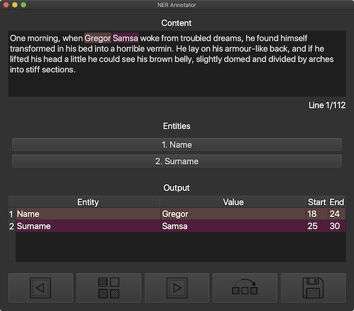
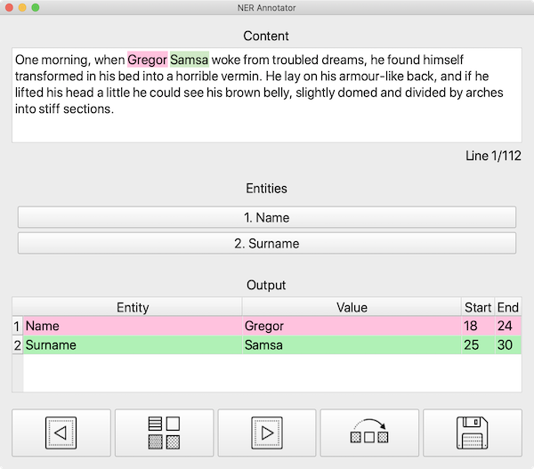

# Named Entity Recognition Annotator

This repository contains a NER utility to annotate text, given some entities.

|               Dark GUI               |               Light GUI                |
| :----------------------------------: | :------------------------------------: |
|  |  |

## Installation

To install this GUI you need to make sure that you have `Python 3` on your system.
Then, `cd` into the project's root and run:

```bash
pip install .
```

This will install the `ner_annotator` package and its required dependencies (mainly `PyQt5`).

## Usage

To run this utility, execute the following command:

```bash
ner_annotator <input> -o <output> -e <entities>
```

Here, `<input>` is the path to the input text file, which should contain your training text lines, separated by newlines; `<output>` is the path to where you would like to save the `.json` output file (if not given, it defaults to the same directory as the input file); `<entities>` is the list of entities you would like to annotate.

For example, I could run the program like this:

```bash
ner_annotator '~/Desktop/train.txt' -e 'BirthDate' 'Name'
```

You can also optionally pass an existing NER model to the annotator, so as to identify entities using that model (button between previous and next line controls in the GUI) and eventually modify/add/remove them. For example:

```bash
ner_annotator '~/Desktop/train.txt' -e 'BirthDate' 'Name' -m '~/Desktop/NER'
```

Currently, only `SpaCy` models are supported, but you can contribute to the project and add compatibility with other NER models, by checking the `model.py` file inside the `ner_annotator` package.

The great thing about this package is that it is able to automagically identify the correct library for the given model (i.e. you don't have to specify that your model should be loaded with `SpaCy` or any other NLP library).

## Config file

In order to have a faster annotation experience, you can save your model entities names to reuse them the next time you are going to need this tool.\
To do that, you need to create a `.json` file (see [assets/json/config.json](`config.json`)), with a schema like the following:

```json
{
	"models": [
		{
			"name": "example-1",
			"entities": ["entity-1-1", "entity-1-2", "entity-1-3"]
		},
		{
			"name": "example-2",
			"entities": ["entity-2-1", "entity-2-2"]
		}
	]
}
```

To use the entities of the model `example-1`, for example, you can run:

```bash
python3 annotator.py '~/Desktop/train.txt' -c '~/Desktop/config.json' -n 'example-1'
```

Here, `~/Desktop/config.json` is the path to the `.json` file mentioned above.\
This bash command will be the equivalent in this example:

```bash
python3 annotator.py '~/Desktop/train.txt' -e 'entity-1-1' 'entity-1-2' 'entity-1-3'
```

## Output

The utility software will output a `.json` file with the following schema:

```json
[
	{
		"content": "text",
		"entities": [[0, 1, "entity"]]
	}
]
```

You can convert this output into the specific format required by your NER model by passing the `-p` option to the `ner_annotator` tool. In this way, on your output folder you will also find a `pickle` file (with the same name as the given `.json` output file, but with no extension), which can then be used to load entities in another program with the requested NLP library. To load the saved pickle file, you can do something along these lines:

```python
import pickle
pickle.load(open("~/Desktop/output", 'rb'))
```

In this example, `ner_annotator` was either called with `-o ~/Desktop/output.json` or without the `-o` option but with `-i ~/Desktop/train.txt` or similar.

Currently, only `SpaCy` models conversion is provided.
