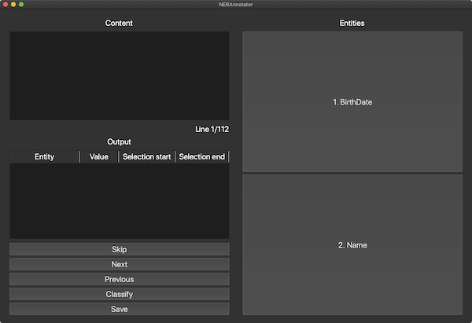

# Named Entity Recognition Annotator

This repository contains a NER utility to annotate text, given some entities.



## Installation

To install this GUI you need to make sure that you have `Python 3` on your system.
Then, `cd` into the project's root and run:

```bash
pip install -r requirements.txt
```

This will install the required dependencies (mainly `PyQt5`).

## Usage
To run this utility, make sure you are in the project's root directory and execute the following command:

```bash
python3 annotator.py <input> -o <output> -e <entities>
```

Here, `<input>` is the path to the input text file, which should contain your training text lines, separated by newlines; `<output>` is the path to where you would like to save the `.json` output file (if not given, it defaults to the same directory as the input file); `<entities>` is the list of entities you would like to annotate.

For example, I could run the program like this:

```bash
python3 annotator.py '~/Desktop/train.txt' -e 'BirthDate' 'Name'
```

You can also optionally pass an existing NER model to the annotator, so as to identify entities using that model (`Classify` button in the GUI) and eventually modify/add/remove them. For example:

```bash
python3 annotator.py '~/Desktop/train.txt' -e 'BirthDate' 'Name' -m '~/Desktop/NER'
```

Currently, only `SpaCy` models are supported.

## Config file
In order to have a faster annotation experience, you can save your model entities names to reuse them the next time you are going to need this tool.\
To do that, you need to create a `.json` file (see [config.json](`config.json`)), with a schema like the following:

```json
{
	"models": [
		{
			"name": "example-1",
			"entities": ["entity-1-1", "entity-1-2", "entity-1-3"]
		},
		{
			"name": "example-2",
			"entities": ["entity-2-1", "entity-2-2"]
		}
	]
}
```

To use the entities of the model `example-1`, for example, you can run:

```bash
python3 annotator.py '~/Desktop/train.txt' -c '~/Desktop/config.json' -n 'example-1'
```

Here, `~/Desktop/config.json` is the path to the `.json` file mentioned above.\
This bash command will be the equivalent in this example:

```bash
python3 annotator.py '~/Desktop/train.txt' -e 'entity-1-1' 'entity-1-2' 'entity-1-3'
```


## Output
The utility software will output a `.json` file with the following schema:

```json
[
	{
		"content": "text",
		"entities": [
			[
				0,
				1,
				"entity"
			]
		]
	}
]
```

You can convert this output into the specific format required by your NER model by implementing a function inside the `converter.py` file. Currently, only the `SpaCy` model conversion is provided.  
